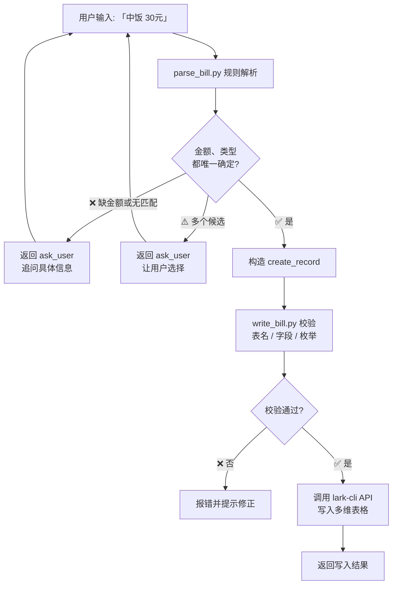

# feishu-bill-entry

飞书多维表格自然语言记账 — **说一句中文，自动写入飞书账单明细表。**

## 这是什么？

一个命令行工具 + AI Agent skill，把"中饭 30 元""昨晚打车 45"这种日常记账语句，自动解析并写入飞书多维表格（Base）的 `明细表`。信息不全时会先追问，不瞎写。由 `parse_bill.py`（解析）+ `write_bill.py`（写入）两个脚本配合完成。

---

## 前置条件

开始使用前，请确保你已经有：

| 项目 | 说明 |
|------|------|
| Python 3.9+ | 运行脚本 |
| [lark-cli](https://github.com/larksuite/lark-cli) | 飞书命令行工具，已登录并授权 Base 读写权限 |
| 飞书多维表格 | 已创建 `明细表`，包含右侧 8 个字段 → | `日期` · `月份` · `支付平台` · `类型` · `收支类型` · `订单号` · `流水说明` · `款项` |

> 💡 没有 Base？在飞书新建一个多维表格，新建一个「明细表」视图，加上面这些字段即可。

---

## 快速上手（5 分钟）

### 第 1 步：设置环境变量

```bash
export FEISHU_BASE_TOKEN="<你的多维表格 Base Token>"
export FEISHU_TABLE_ID="<你的明细表 Table ID>"
export FEISHU_TABLE_NAME="明细表"
```

> 不知道怎么获取 Token 和 Table ID？请参考 [lark-cli Base 文档](https://github.com/larksuite/lark-cli)。

### 第 2 步：试解析（不下笔）

```bash
python3 scripts/parse_bill.py --text "中饭 30元"
```

你会看到类似这样的输出 —— 说明解析成功：

```json
{"action": "create_record", "records": [{
  "date": "2026-06-26", "month": "6月",
  "payment_platform": "", "category": "餐食（三餐+盒马山姆都算）",
  "income_type": "支出", "order_no": "", "note": "中饭", "amount": 30.0
}], "questions": [], "reason": ""}
```

### 第 3 步：试写入（预览模式）

```bash
python3 scripts/parse_bill.py --text "中饭 30元" \
  | python3 scripts/write_bill.py \
      --base-token "$FEISHU_BASE_TOKEN" \
      --table-id "$FEISHU_TABLE_ID" \
      --expected-table-name "$FEISHU_TABLE_NAME" \
      --dry-run
```

`--dry-run` 表示只校验不写入，安全预览。

### 第 4 步：正式记账

去掉 `--dry-run`，真正写入飞书：

```bash
python3 scripts/parse_bill.py --text "中饭 30元" \
  | python3 scripts/write_bill.py \
      --base-token "$FEISHU_BASE_TOKEN" \
      --table-id "$FEISHU_TABLE_ID" \
      --expected-table-name "$FEISHU_TABLE_NAME"
```

打开飞书多维表格，确认数据已写入 `明细表`。

---

## 使用示例

| 输入 | 类型 | 金额 | 流水说明 | 日期 |
|------|------|------|----------|------|
| `中饭 30元` | 餐食 | 30 | `中饭` | 今天 |
| `昨晚打车 45` | 停车费及其他交通费 | 45 | `打车` | 昨天 |
| `今天地铁往返5元` | 停车费及其他交通费 | 5 | `地铁往返` | 今天 |
| `昨天退了外卖 25` | 餐食 | -25 | `退了外卖` | 昨天 |
| `支付宝交电费 200` | 水电费 | 200 | `交电费` | 今天 |
| `信用卡还房贷 5000` | 房贷 | 5000 | `还房贷` | 今天 |

> - 日期关键词：`今天`（默认）、`昨天`、`前天` → 自动计算
> - 支付平台：`支付宝` `微信` `信用卡` → 自动识别
> - 退款：含"退款/退了"等 → 金额自动为负数

### 信息不全时（系统会先问）

```bash
$ python3 scripts/parse_bill.py --text "打车"
{"action": "ask_user", "questions": ["这笔多少钱？"], "reason": "missing_amount"}
```

```bash
$ python3 scripts/parse_bill.py --text "买了个东西 50"
{"action": "ask_user", "questions": ["这笔记成什么类型？请使用明细表已有分类。"], "reason": "missing_category"}
```

---

## 数据表结构（明细表）

你的飞书多维表格 `明细表` 需要包含以下 8 个字段。

### 字段定义一览

| 字段名 | Feishu 类型 | 必填 | 脚本字段 | 示例值 | 说明 |
|--------|-------------|------|----------|--------|------|
| 日期 | 日期 (type 5) | ✅ | `date` | `2026-06-26` | 消费发生日期，默认今天；支持昨天/前天推算 |
| 月份 | 单选 (type 3) | ✅ | `month` | `6月` | 由日期自动换算，用于月度筛选 |
| 支付平台 | 单选 (type 3) | ❌ | `payment_platform` | `支付宝` | 仅识别：支付宝 / 微信 / 信用卡；未提及则留空 |
| 类型 | 单选 (type 3) | ✅ | `category` | `餐食（三餐+盒马山姆都算）` | ⭐ **严格使用已有枚举**，共 21 种（见下方） |
| 收支类型 | 单选 (type 3) | ✅ | `income_type` | `支出` | 仅两个值：`支出` / `收入` |
| 订单号 | 文本 (type 1) | ❌ | `order_no` | `202606260001` | 预留字段，暂未使用，始终为空 |
| 流水说明 | 文本 (type 1) | ✅ | `note` | `中饭` | 脚本自动清洗：去掉金额数字和时间前缀词 |
| 款项 | 数字 (type 2) | ✅ | `amount` | `30` / `-25` | 退款自动取负值（如 `退款 25` → `-25`） |

### 单选字段可选值

| 字段 | 可选值（共） | 所有取值 |
|------|-------------|----------|
| 月份 | 12 | `1月` ~ `12月` |
| 支付平台 | 3 | `支付宝` · `微信` · `信用卡` |
| 收支类型 | 2 | `支出` · `收入` |
| 类型 | 21 | `餐食（三餐+盒马山姆都算）` · `停车费及其他交通费` · `车子养护（电费、保养等）` · `水电费` · `话费` · `物业费` · `房贷` · `服饰大类` · `养狗相关费用` · `医药费` · `旅行费用（含etc）` · `兴趣类支出` · `其他家用` · `热植相关` · `节日、礼金等` · `小健家招待` · `公司请客` · `工资收入` · `其他收入` · `理财收入` · `亚琪副业` |

### 脚本字段 → Base 字段映射

`parse_bill.py` 输出的 JSON 字段与 Base 表字段的一一对应关系，定义在 `references/table-schema.json` 中。二次开发时参考此文件即可理解数据流：

```json
{
  "field_mapping": {
    "date":           "日期",
    "month":          "月份",
    "payment_platform": "支付平台",
    "category":       "类型",
    "income_type":    "收支类型",
    "order_no":       "订单号",
    "note":           "流水说明",
    "amount":         "款项"
  }
}
```

### 关于"类型"分类关键词

`类型` 字段的 21 个枚举值各对应一组关键词，定义在 `references/type-map.json` 中。例如：

```json
{
  "type_map": {
    "餐食（三餐+盒马山姆都算）": ["饭", "餐", "吃", "外卖", "中饭", "早", "晚", "盒马", "山姆", "水果", ...],
    "停车费及其他交通费": ["打车", "地铁", "停车", "公交", "加油", "ETC", ...],
    ...
  }
}
```

> ✏️ 想调整关键词？直接修改 `references/type-map.json` 即可，无需改 Python 代码。

### 快速建表 / 检查表结构

如果你已有 Base，可以用以下命令检查表结构是否满足要求：

```bash
# 查看表名与元信息
lark-cli base +table-get \
  --as user \
  --base-token "<your_base_token>" \
  --table-id "<your_table_id>"

# 列出所有字段及其类型、枚举
lark-cli base +field-list \
  --as user \
  --base-token "<your_base_token>" \
  --table-id "<your_table_id>" \
  --format json
```

> 💡 **新人建表指引**：在飞书新建一个「多维表格」→ 将默认的"表格 1"重命名为 `明细表` → 按照上面"字段定义一览"表格手动添加 8 个字段，设置对应的字段类型和单选选项值。`write_bill.py` 写入时会自动校验字段完整性。

机器可读的完整表结构定义见 `references/table-schema.json`，包含每个字段的 Feishu 类型 ID、必填标记、选项列表、字段映射和备注说明。

---

## 工作流程



**核心原则：宁可多问一次，也不写错一笔。**

---

## 什么时候用 / 什么时候不适合

### ✅ 适合

| 场景 | 举例 |
|------|------|
| 日常单笔记账 | `"中饭 30元"` `"昨晚打车 45"` |
| 快速录入飞书多维表 | 说一句话，自动写入 |
| 已有固定分类 | 类型枚举已覆盖你的消费类别 |
| 可接受追问 | 信息不全时愿意回答系统提问 |

### ❌ 暂不适合

| 场景 | 原因 |
|------|------|
| 批量导入历史流水 | 一条条说太慢，建议用 Excel 导入 |
| 截图/拍照识别 | 不支持 OCR，需要文字输入 |
| 自动生成月报/统计图表 | 只负责录入，分析请用 Base 的统计功能 |
| 自动创建新分类 | `类型` 必须使用已有枚举，不会新增 |

---

## 目录结构

```
feishu-bill-entry/
├── README.md                 ← 本文件，新人入门文档
├── SKILL.md                  ← AI Agent 执行文档（精简版）
├── references/
│   └── type-map.json         ← 分类关键词映射表（唯一数据源）
├── scripts/
│   ├── parse_bill.py         ← 自然语言 → 结构化记录
│   ├── write_bill.py         ← 结构化记录 → 飞书 Base
│   └── USAGE.md              ← 脚本参数详解
├── LICENSE
└── .gitignore
```

---

## 许可

[MIT](./LICENSE)
