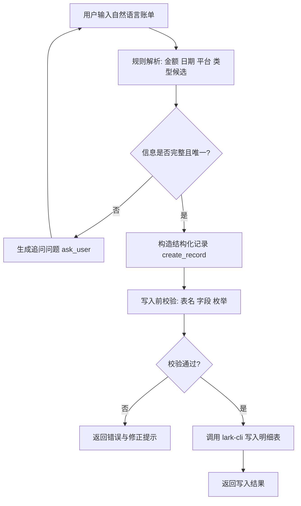

# feishu-bill-entry

飞书多维表格自然语言记账 — 说一句中文，自动记入飞书账单。

## 快速开始

```bash
export FEISHU_BASE_TOKEN="<your_base_token>"
export FEISHU_TABLE_ID="<your_detail_table_id>"
export FEISHU_TABLE_NAME="明细表"

python3 scripts/parse_bill.py --text "今天中饭消费 30 元" \
  | python3 scripts/write_bill.py \
      --base-token "$FEISHU_BASE_TOKEN" \
      --table-id "$FEISHU_TABLE_ID" \
      --expected-table-name "$FEISHU_TABLE_NAME" \
      --dry-run
```

去掉 `--dry-run` 即可真实写入。

## 功能

- 解析自然语言记账，提取金额、日期、分类
- 严格使用已有 `类型` 枚举，不编造新分类
- 信息不完整或有歧义时先追问
- 通过 `lark-cli` 写入飞书多维表格

## 业务流程



流程解读：

1. 输入先走规则解析，优先低 token 成本。
2. 若金额/类型等不确定，先追问用户，不直接写入。
3. 能唯一确定后再写入，并在写入前做目标表校验。
4. 校验通过才真正调用飞书 API。

## 数据表结构（明细表）

| 字段名 | 类型 | 示例 | 说明 |
|---|---|---|---|
| 日期 | datetime | `2026-06-26` | 消费/收入发生日期 |
| 月份 | select | `6月` | 由日期自动换算 |
| 支付平台 | select | `支付宝` | 可空，常见为支付宝/微信/信用卡 |
| 类型 | select | `餐食（三餐+盒马山姆都算）` | 严格使用已有枚举，不新增 |
| 收支类型 | select | `支出` | 仅 `支出` / `收入` |
| 订单号 | text | `202606260001` | 可空 |
| 流水说明 | text | `今天中饭消费 30元` | 保留用户原始描述摘要 |
| 款项 | number | `30` / `-25` | 退款按负数处理 |

## 目录结构

```
feishu-bill-entry/
├── SKILL.md              # Agent skill 主文档（完整说明）
├── references/
│   ├── type-map.md       # 分类关键词映射表（人类可读）
│   └── type-map.json     # 分类映射数据源（脚本自动读取）
├── scripts/
│   ├── parse_bill.py     # 自然语言解析器
│   ├── write_bill.py     # Base 写入器
│   └── USAGE.md          # 脚本用法详解
├── LICENSE
└── .gitignore
```

## 文档

完整说明请查看 [SKILL.md](./SKILL.md)，包含：

- 字段映射规则
- 10 条自测用例
- FAQ
- 安全建议

## 前置条件

- Python 3.9+
- [lark-cli](https://github.com/larksuite/lark-cli) 已安装并授权
- 目标飞书多维表已包含 `日期`、`月份`、`支付平台`、`类型`、`收支类型`、`订单号`、`流水说明`、`款项` 字段

## 许可

[MIT](./LICENSE)
