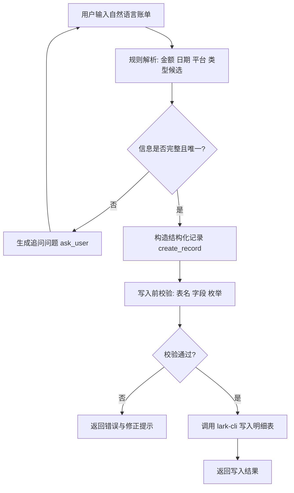

# 飞书账单自然语言录入

> **前置条件：** 先完成 `lark-cli` 登录授权，并确认目标 Base / table 可访问。

## 这个 Skill 做什么

- 解析中文记账输入，例如：`今天中饭消费 30 元`
- 将口语映射到已有 `类型` 枚举（严格不新增）
- 生成结构化账单并写入飞书多维表格 `明细表`
- 信息不完整或有歧义时先追问，不盲写

## 环境要求

- Python 3.9+
- 已安装并可用的 `lark-cli`
- 已完成 `lark-cli` 用户授权
- 目标多维表包含以下字段：
  - `日期` `月份` `支付平台` `类型` `收支类型` `订单号` `流水说明` `款项`

## 工作方式

1. 先做规则抽取，尽量不用大模型推理。
2. 再按本地分类映射表把口语词映射到已有 `类型` 枚举。
3. 如果类型无法唯一命中，先追问用户，不要猜。
4. 如果信息足够明确，再写入 `明细表`。

### 业务流程图



流程解读：

1. 输入先走规则解析，优先低 token 成本。
2. 若金额/类型等不确定，先 `ask_user`，不直接写入。
3. 能唯一确定后再写入，并在写入前做目标表校验。
4. 校验通过才真正调用飞书 API。

## 如何获取 `base_token` 和 `table_id`

1. 从 Base URL 提取：
   - URL 结构：`https://my.feishu.cn/base/<base_token>?table=<table_id>&view=<view_id>`
2. 登录授权：

```bash
lark-cli auth login --scope base:app:read
```

3. 查看 Base 下所有表并找到你的明细表：

```bash
lark-cli base +table-list --as user --base-token "<your_base_token>" --format pretty
```

4. （可选）校验目标表字段：

```bash
lark-cli base +field-list --as user --base-token "<your_base_token>" --table-id "<your_detail_table_id>" --format pretty
```

## 目标表结构（明细表）

| 字段名 | 类型 | 示例 | 说明 |
|---|---|---|---|
| 日期 | datetime | `2026-06-26` | 消费/收入发生日期 |
| 月份 | select | `6月` | 由日期换算 |
| 支付平台 | select | `支付宝` | 可空，常见为支付宝/微信/信用卡 |
| 类型 | select | `餐食（三餐+盒马山姆都算）` | 严格使用已有枚举 |
| 收支类型 | select | `支出` | 仅 `支出` / `收入` |
| 订单号 | text | `202606260001` | 可空 |
| 流水说明 | text | `今天中饭消费 30元` | 保留用户原始描述摘要 |
| 款项 | number | `30` / `-25` | 退款按负数处理 |

## 解析规则

- `日期`：默认今天；支持昨天、前天、明确日期。
- `月份`：由 `日期` 自动换算成 `1月` 到 `12月`。
- `收支类型`：只允许 `支出` / `收入`。
- `支付平台`：只用现有选项 `支付宝` / `微信` / `信用卡`；没提到就留空。
- `流水说明`：保留短摘要，不要长篇解释。
- `订单号`：用户明确给出才写。
- `退款`：按负支出处理，不改成收入。

## `类型` 严格约束

- 只能写入已有枚举。
- 不允许新增分类。
- 不允许把口语词原样写进 `类型`。
- 不允许写"近似但不存在"的分类。
- 多候选时必须追问。

完整映射见 [`references/type-map.json`](references/type-map.json)，修改后无需改动代码。

## 写入前检查

写入前必须确认：

- 金额已抽取为数值
- 日期已标准化
- `类型` 能唯一映射到现有枚举
- `收支类型` 合法
- 目标表、字段名和字段类型与真实 Base 一致

写入 Base 时优先使用 `lark-cli base +record-upsert`。

## 省 token 策略

- 高频输入走确定性规则
- 映射表放在本地 reference，不重复塞进上下文
- 输出尽量只给结构化草稿或追问
- 只有歧义时才调用模型兜底

## 追问策略

以下情况必须追问：

- 金额缺失或歧义
- 日期不明确
- `类型` 无法唯一映射
- 用户说"改一下""补一笔"，但没有明确目标记录

追问要短，一次只问最必要的问题。

## 推荐写入字段

优先写入：

- `日期`
- `月份`
- `款项`
- `收支类型`
- `类型`
- `流水说明`

`支付平台` 和 `订单号` 只有在明确时写入。

## 快速开始

```bash
export FEISHU_BASE_TOKEN="<your_base_token>"
export FEISHU_TABLE_ID="<your_detail_table_id>"
export FEISHU_TABLE_NAME="明细表"

# 解析并写入（先 dry-run 验证）
python3 scripts/parse_bill.py --text "今天中饭消费 30 元" \
  | python3 scripts/write_bill.py \
      --base-token "$FEISHU_BASE_TOKEN" \
      --table-id "$FEISHU_TABLE_ID" \
      --expected-table-name "$FEISHU_TABLE_NAME" \
      --dry-run

# 去掉 --dry-run 即可真实写入
```

## 脚本说明

本 skill 提供两个脚本：

1. **`scripts/parse_bill.py`** — 解析自然语言，输出结构化 JSON
2. **`scripts/write_bill.py`** — 接收 parse_bill.py 的 JSON 输出，写入飞书 Base

典型用法：

```bash
# 仅解析
python3 scripts/parse_bill.py --text "今天中饭消费 30 元"

# 解析后直接写入
python3 scripts/parse_bill.py --text "今天中饭消费 30 元" \
  | python3 scripts/write_bill.py \
      --base-token "$FEISHU_BASE_TOKEN" \
      --table-id "$FEISHU_TABLE_ID" \
      --expected-table-name "$FEISHU_TABLE_NAME"
```

说明：

- `write_bill.py` 仅接受 `parse_bill.py` 的 JSON 输出作为 stdin。
- 只有 `action=create_record` 才会执行写入。
- `action=ask_user` 或 `action=reject` 时不会写入，并原样返回。

## 安全建议

- 不要把真实 `base_token`、私有 `table_id` 提交到公开仓库。
- 示例命令统一使用占位符或环境变量。

## FAQ（常见问题）

1. **现象：返回 `target_table_validation_failed`**
   原因：`base_token`、`table_id` 或 `--expected-table-name` 不正确。
   处理：
   ```bash
   lark-cli base +table-list --as user --base-token "<your_base_token>" --format pretty
   lark-cli base +field-list --as user --base-token "<your_base_token>" --table-id "<your_detail_table_id>" --format pretty
   ```

2. **现象：返回 `ask_user`，提示"类型有多个候选"**
   原因：一句话命中了多个分类关键词（例如"请客吃饭"可能命中多个类型）。
   处理：按提示明确指定一个已有类型后再写入。

3. **现象：写入时报权限错误（permission denied / scope）**
   原因：`lark-cli` 未授权或授权范围不够。
   处理：
   ```bash
   lark-cli auth login --scope base:app:read
   ```

4. **现象：报网络错误（例如 `lookup open.feishu.cn: no such host`）**
   原因：本机网络或 DNS 问题，无法访问飞书 OpenAPI。
   处理：检查代理 / DNS / 网络连通性，恢复后重试。

5. **现象：分类看起来"识别错了"**
   原因：当前采用规则优先，关键词可能与你的业务语义不一致。
   处理：修改 `references/type-map.json` 中对应分类的关键词列表。

## 自测语句（10条）

可用下面命令快速验证解析结果：

```bash
python3 scripts/parse_bill.py --text "<测试语句>"
```

| # | 输入 | 预期 action | 预期类型 | 预期款项 |
|---|---|---|---|---|
| 1 | `今天中饭消费 30元` | `create_record` | 餐食（三餐+盒马山姆都算） | `30` |
| 2 | `昨晚打车45` | `create_record` | 停车费及其他交通费 | `45` |
| 3 | `昨天买菜 126.3` | `create_record` | 餐食（三餐+盒马山姆都算） | `126.3` |
| 4 | `支付宝 充话费 100` | `create_record` | 话费 | `100` |
| 5 | `微信交物业费 500` | `create_record` | 物业费 | `500` |
| 6 | `退了外卖25` | `create_record` | 餐食（三餐+盒马山姆都算） | `-25` |
| 7 | `请客吃饭 200` | `ask_user` | —（类型歧义） | — |
| 8 | `30元` | `ask_user` | —（缺少类型信息） | — |
| 9 | `今天买衣服 399` | `create_record` | 服饰大类 | `399` |
| 10 | `工资 12000` | `create_record` | 工资收入 | `12000` |
