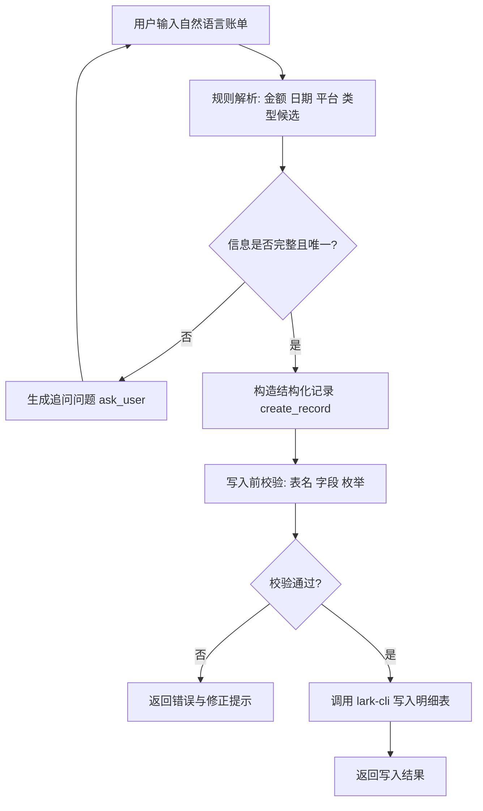
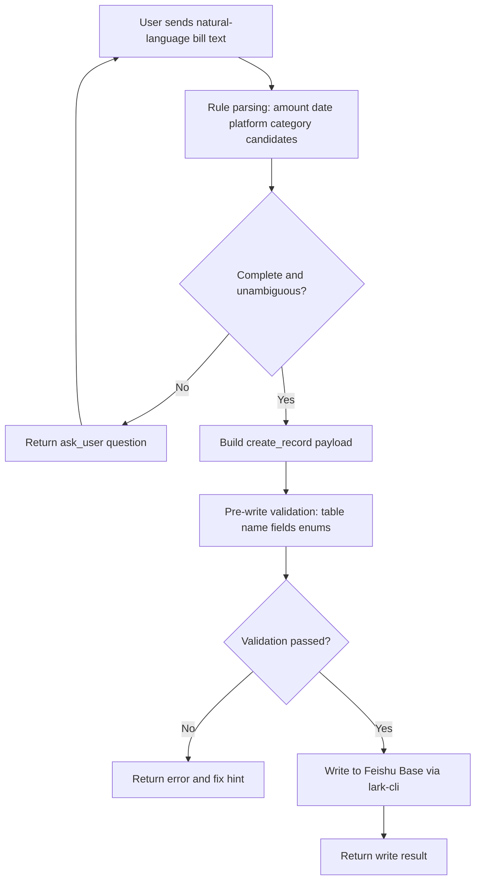

# feishu-bill-entry

中文：飞书多维表格自然语言记账 Skill。  
English: A natural-language bill entry skill for Feishu Base detail tables.

## 中文说明

### 这个 Skill 做什么

- 解析中文记账输入，例如：`今天中饭消费 30元`
- 将口语映射到已有 `类型` 枚举（严格不新增）
- 生成结构化账单并写入飞书多维表格 `明细表`
- 信息不完整或有歧义时先追问，不盲写

### 环境要求

- Python 3.9+
- 已安装并可用的 `lark-cli`
- 已完成 `lark-cli` 用户授权
- 目标多维表包含以下字段：
  - `日期` `月份` `支付平台` `类型` `收支类型` `订单号` `流水说明` `款项`

### 如何获取 `base_token` 和 `table_id`

1. 从 Base URL 提取：
   - URL 结构：`https://my.feishu.cn/base/<base_token>?table=<table_id>&view=<view_id>`
2. 登录授权：

```bash
lark-cli auth login --scope base:app:read
```

3. 查看 Base 下所有表并找到你的明细表：

```bash
lark-cli base +table-list --as user --base-token "<your_base_token>" --format pretty
```

4. （可选）校验目标表字段：

```bash
lark-cli base +field-list --as user --base-token "<your_base_token>" --table-id "<your_detail_table_id>" --format pretty
```

### 飞书多维表结构说明（明细表）

| 字段名 | 类型 | 示例 | 说明 |
|---|---|---|---|
| 日期 | datetime | `2026-06-26` | 消费/收入发生日期 |
| 月份 | select | `6月` | 由日期换算 |
| 支付平台 | select | `支付宝` | 可空，常见为支付宝/微信/信用卡 |
| 类型 | select | `餐食（三餐+盒马山姆都算）` | 严格使用已有枚举 |
| 收支类型 | select | `支出` | 仅 `支出` / `收入` |
| 订单号 | text | `202606260001` | 可空 |
| 流水说明 | text | `今天中饭消费 30元` | 保留用户原始描述摘要 |
| 款项 | number | `30` / `-25` | 退款按负数处理 |

### 业务流程图说明



流程解读：

1. 输入先走规则解析，优先低 token 成本。
2. 若金额/类型等不确定，先 `ask_user`，不直接写入。
3. 能唯一确定后再写入，并在写入前做目标表校验。
4. 校验通过才真正调用飞书 API。

### 快速开始

```bash
export FEISHU_BASE_TOKEN="<your_base_token>"
export FEISHU_TABLE_ID="<your_detail_table_id>"
export FEISHU_TABLE_NAME="明细表"

python3 skills/feishu-bill-entry/scripts/parse_bill.py --text "今天中饭消费 30 元" \
  | python3 skills/feishu-bill-entry/scripts/write_bill.py \
      --base-token "$FEISHU_BASE_TOKEN" \
      --table-id "$FEISHU_TABLE_ID" \
      --expected-table-name "$FEISHU_TABLE_NAME" \
      --dry-run
```

去掉 `--dry-run` 即可真实写入。

### 安全建议

- 不要把真实 `base_token`、私有 `table_id` 提交到公开仓库。
- 示例命令统一使用占位符或环境变量。

### FAQ（常见问题）

1. 现象：返回 `target_table_validation_failed`
原因：`base_token`、`table_id` 或 `--expected-table-name` 不正确。
处理：
```bash
lark-cli base +table-list --as user --base-token "<your_base_token>" --format pretty
lark-cli base +field-list --as user --base-token "<your_base_token>" --table-id "<your_detail_table_id>" --format pretty
```

2. 现象：返回 `ask_user`，提示“类型有多个候选”
原因：一句话命中了多个分类关键词（例如“请客吃饭”可能命中多个类型）。
处理：按提示明确指定一个已有类型后再写入。

3. 现象：写入时报权限错误（permission denied / scope）
原因：`lark-cli` 未授权或授权范围不够。
处理：
```bash
lark-cli auth login --scope base:app:read
```

4. 现象：报网络错误（例如 `lookup open.feishu.cn: no such host`）
原因：本机网络或 DNS 问题，无法访问飞书 OpenAPI。
处理：检查代理 / DNS / 网络连通性，恢复后重试。

5. 现象：分类看起来“识别错了”
原因：当前采用规则优先，关键词可能与你的业务语义不一致。
处理：修改 `scripts/parse_bill.py` 中 `TYPE_MAP` 关键词映射。

### 自测语句（10条）

可用下面命令快速验证解析结果：

```bash
python3 skills/feishu-bill-entry/scripts/parse_bill.py --text "<测试语句>"
```

1. `今天中饭消费 30元`
预期：`create_record`；类型=`餐食（三餐+盒马山姆都算）`；款项=`30`

2. `昨晚打车45`
预期：`create_record`；类型=`停车费及其他交通费`；款项=`45`

3. `昨天买菜 126.3`
预期：`create_record`；类型=`餐食（三餐+盒马山姆都算）`；款项=`126.3`

4. `支付宝 充话费 100`
预期：`create_record`；支付平台=`支付宝`；类型=`话费`

5. `微信交物业费 500`
预期：`create_record`；支付平台=`微信`；类型=`物业费`

6. `退了外卖25`
预期：`create_record`；类型=`餐食（三餐+盒马山姆都算）`；款项=`-25`

7. `请客吃饭 200`
预期：`ask_user`（类型歧义，需人工选一个已有类型）

8. `30元`
预期：`ask_user`（缺少类型信息）

9. `今天买衣服 399`
预期：`create_record`；类型=`服饰大类`

10. `工资 12000`
预期：`create_record`；收支类型=`收入`；类型=`工资收入`

---

## English

### What this skill does

- Parses Chinese bill text, e.g. `今天中饭消费 30元`
- Maps colloquial terms to existing `类型` enum options (strict, no new category)
- Writes structured records into a Feishu Base detail table
- Asks follow-up questions instead of guessing when input is ambiguous

### Requirements

- Python 3.9+
- `lark-cli` installed
- Authenticated `lark-cli` user session
- Target detail table includes:
  - `日期` `月份` `支付平台` `类型` `收支类型` `订单号` `流水说明` `款项`

### How to get `base_token` and `table_id`

1. Extract from your Base URL:
   - URL pattern: `https://my.feishu.cn/base/<base_token>?table=<table_id>&view=<view_id>`
2. Authenticate:

```bash
lark-cli auth login --scope base:app:read
```

3. List tables and find your detail table id:

```bash
lark-cli base +table-list --as user --base-token "<your_base_token>" --format pretty
```

4. (Optional) Validate field schema:

```bash
lark-cli base +field-list --as user --base-token "<your_base_token>" --table-id "<your_detail_table_id>" --format pretty
```

### Feishu Base schema (Detail Table)

| Field | Type | Example | Notes |
|---|---|---|---|
| 日期 | datetime | `2026-06-26` | Transaction date |
| 月份 | select | `6月` | Derived from `日期` |
| 支付平台 | select | `支付宝` | Optional |
| 类型 | select | `餐食（三餐+盒马山姆都算）` | Must match existing enums |
| 收支类型 | select | `支出` | Only `支出` / `收入` |
| 订单号 | text | `202606260001` | Optional |
| 流水说明 | text | `今天中饭消费 30元` | Compact raw note |
| 款项 | number | `30` / `-25` | Refund uses negative expense |

### Business flow



### Quick start

```bash
export FEISHU_BASE_TOKEN="<your_base_token>"
export FEISHU_TABLE_ID="<your_detail_table_id>"
export FEISHU_TABLE_NAME="明细表"

python3 skills/feishu-bill-entry/scripts/parse_bill.py --text "今天中饭消费 30 元" \
  | python3 skills/feishu-bill-entry/scripts/write_bill.py \
      --base-token "$FEISHU_BASE_TOKEN" \
      --table-id "$FEISHU_TABLE_ID" \
      --expected-table-name "$FEISHU_TABLE_NAME" \
      --dry-run
```

Remove `--dry-run` for actual writes.

### Security notes

- Never commit real `base_token` or private `table_id`.
- Keep public examples generic and env-based.

### FAQ

1. Symptom: `target_table_validation_failed`
Cause: Incorrect `base_token`, `table_id`, or `--expected-table-name`.
Fix:
```bash
lark-cli base +table-list --as user --base-token "<your_base_token>" --format pretty
lark-cli base +field-list --as user --base-token "<your_base_token>" --table-id "<your_detail_table_id>" --format pretty
```

2. Symptom: parser returns `ask_user` with ambiguous category
Cause: Input matches multiple category keywords.
Fix: Provide one explicit existing enum value, then retry.

3. Symptom: permission denied / scope error
Cause: Missing or expired auth scope for Base APIs.
Fix:
```bash
lark-cli auth login --scope base:app:read
```

4. Symptom: network error like `lookup open.feishu.cn: no such host`
Cause: Local DNS/network connectivity issue.
Fix: Check DNS/proxy/network, then retry.

5. Symptom: category mapping does not match your business expectation
Cause: Rule-first parser uses static keyword mappings.
Fix: Adjust `TYPE_MAP` in `scripts/parse_bill.py`.

### Test Sentences (10 examples)

Run this for each sentence:

```bash
python3 skills/feishu-bill-entry/scripts/parse_bill.py --text "<test sentence>"
```

1. `今天中饭消费 30元`
Expected: `create_record`; category=`餐食（三餐+盒马山姆都算）`; amount=`30`

2. `昨晚打车45`
Expected: `create_record`; category=`停车费及其他交通费`; amount=`45`

3. `昨天买菜 126.3`
Expected: `create_record`; category=`餐食（三餐+盒马山姆都算）`; amount=`126.3`

4. `支付宝 充话费 100`
Expected: `create_record`; payment platform=`支付宝`; category=`话费`

5. `微信交物业费 500`
Expected: `create_record`; payment platform=`微信`; category=`物业费`

6. `退了外卖25`
Expected: `create_record`; category=`餐食（三餐+盒马山姆都算）`; amount=`-25`

7. `请客吃饭 200`
Expected: `ask_user` (ambiguous category, user confirmation required)

8. `30元`
Expected: `ask_user` (missing category info)

9. `今天买衣服 399`
Expected: `create_record`; category=`服饰大类`

10. `工资 12000`
Expected: `create_record`; income type=`收入`; category=`工资收入`
